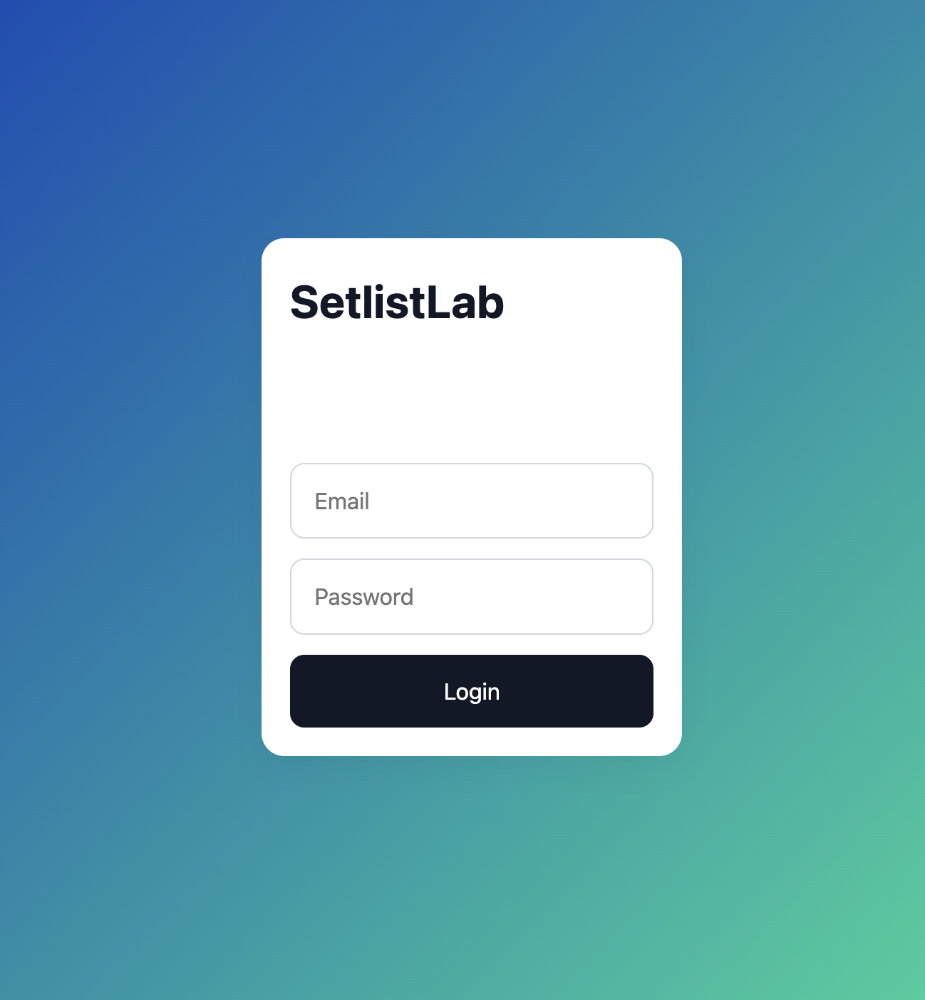
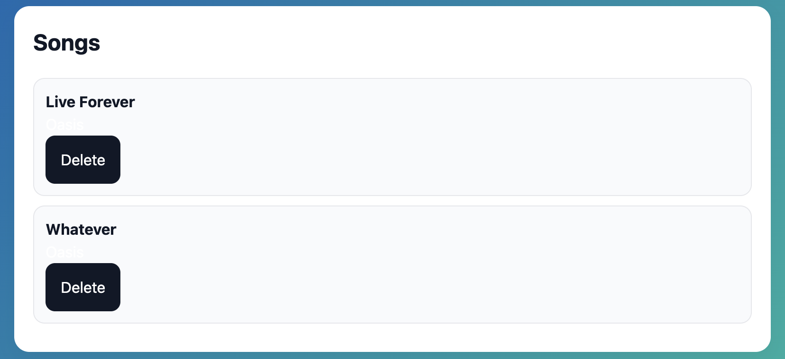
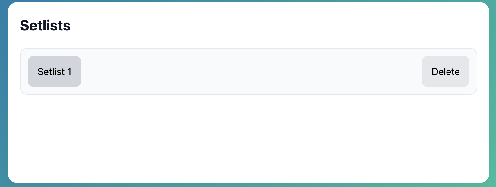

# 🎸 SetlistLab

A full-stack MERN application that helps musicians organise songs and build reusable setlists for live performances.


---

## 🌐 Live Demo

**Frontend**

https://setlistlab-frontend-8e968661be01.herokuapp.com/

**Backend Repository**

https://github.com/tomrhysjones/setlistlab-backend

## 🔐 Authentication

Users register and log in through dedicated authentication routes. Passwords are hashed using bcrypt, and protected API routes require a valid JSON Web Token.

Each user can access and manage only their own songs and setlists.

---

## 📖 Overview

SetlistLab is a full-stack MERN application that enables musicians to organise songs and create reusable live performance setlists.

Built with React on the frontend and a Node.js/Express REST API backed by MongoDB, the application provides secure authentication and full CRUD functionality for managing songs and setlists.

---

## ✨ Features

- Secure user authentication
- Create, edit and delete songs
- Create, edit and delete setlists
- Add songs to setlists
- Remove songs from setlists
- Responsive interface
- RESTful API integration

---

## 🛠 Tech Stack

### Frontend

- React
- Vite
- React Router
- Axios
- CSS

### Backend

- Node.js
- Express
- MongoDB
- Mongoose

---

## 📸 Screenshots

### Login



### Dashboard


### Songs



### Create Setlist


### Setlists



### Setlist Details


---

## 🚀 Installation

```bash
git clone https://github.com/tomrhysjones/setlistlab-frontend
```

```bash
npm install
```

```bash
npm run dev
```

---

## 📈 Future Improvements

- Drag-and-drop song ordering
- Search songs
- Search setlists
- Dark mode
- Printable setlists
- Export to PDF

---

## 👨‍💻 Author

**Tom Rhys Jones**

- GitHub: https://github.com/tomrhysjones
- LinkedIn: https://www.linkedin.com/in/tom-rhys-jones-63b553209/
